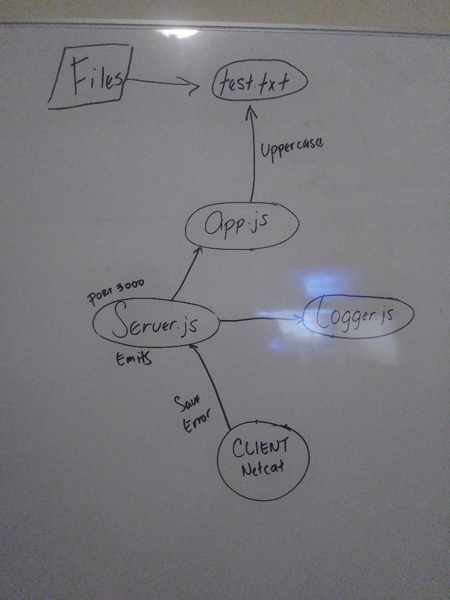

# LAB - 18

## Socket.io

### Author: Joseph Hangarter

### Links and Resources
* [submission PR](http://xyz.com)
* [travis](http://xyz.com)

#### Documentation
* [api docs](http://xyz.com) (API servers)
* [jsdoc](http://xyz.com) (Server assignments)
* [styleguide](http://xyz.com) (React assignments)

### Modules
#### `app.js` - File Reading/Writing/Uppercasing (promises)
#### `logger.js` - Listens for file-save and file-error events
#### `server.js` - emits() the appropriate event and payload to clients

##### Exported Values and Methods
###### `loadFile(file) -> readFile`
###### `saveFile(file, buffer) -> writeFile`
###### `convertBuffer(buffer) -> toString, toUppercase`

### Setup
#### `.env` requirements
* `PORT` - 3000
* `https://socket.io/docs/emit-cheatsheet/` - cheatsheet for socket.io commands

#### Running the app
* `curl ifconfig.me` to obtain IP address for windows
* `node app.js 'files/test.txt'` - to run read/write fs
  
#### Tests
* `npm test`

#### UML
